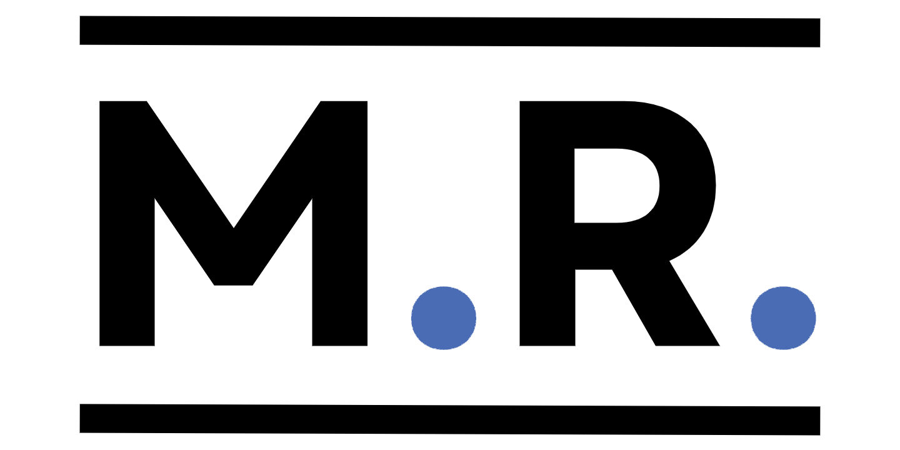
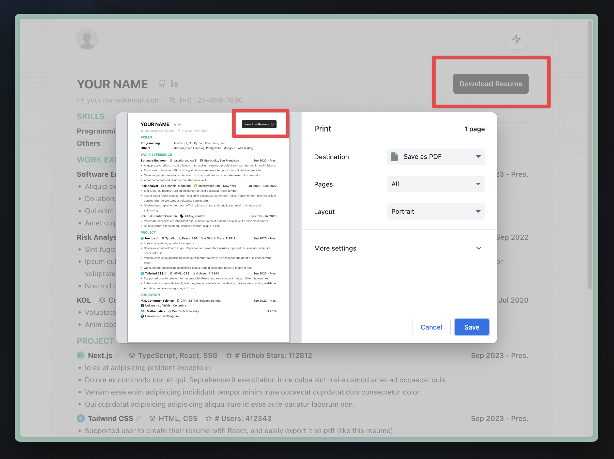
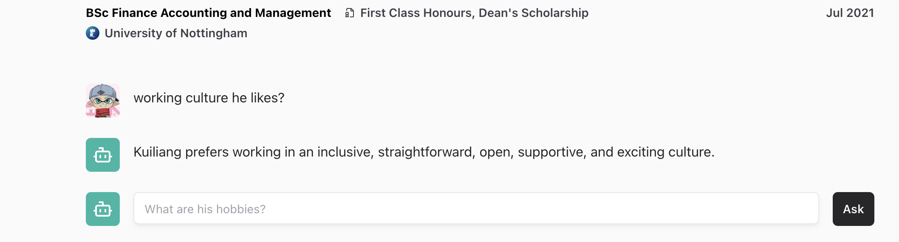
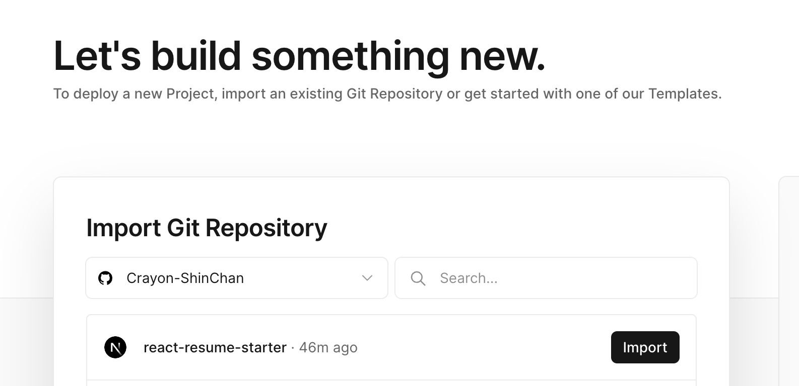

<p align="center">

</p>

<div align="center">


A framework to create new generation resume with power of React and Markdown.

[📺 Examples](https://react-resume-starter.vercel.app/) | [🌎 Discord](https://discord.gg/62ZaHPETY4) 

</div>

---

## 🚨 Upcoming Changes 

The main branch (v0.1) is now in a feature freeze. The next version is being developed in the [markdown-support branch](https://github.com/Crayon-ShinChan/mr-resume/tree/markdown-support).
Find out more about the those changes [here](https://mr-resume.com/roadmap).

## Motivation

This is a resume starter/template to allow you writing your resume with React.

It has the following features:

1. ✍️ Write once, get a website & PDF!
2. 📱 Super responsive & interactive (mobile-friendly)
3. 📈 Real-time data from API call, e.g. the number of Github stars of your repo
4. 🌓 Dark/Light Mode + All the animations you desire
5. 🤖 (To be added) GPT Integration: Have AI answer queries about you!
6. ... and all the magic React offers!

## Overview

[Live Deployment of this repo](https://react-resume-starter.vercel.app/) (With all features mentioned above but GPT integration)


You can download PDF version of this resume by click the download button on the top right corner. Note the best way to print is to print it in Chrome/Arc Browser with A4 Size like the following.



In your download PDF file, the button in the top right corner will be "View Live Resume" button to let your reader to go to your website (live resume).

[My Resume](https://kuiliang.vercel.app/resume) (With GPT integration)



## Getting Started

fork/clone this repo

Go to the folder you cloned, run the development server:

```bash
npm install
npm run dev
```

Open [http://localhost:3000](http://localhost:3000) with your browser to see the result.

You can start editing the sections in the resume by modifying files in `components/section` folder. And change the your photo in the navbar by change the file `/components/header.tsx` and `public/images/portrait.jpeg`.

## Learn More

To learn more about Next.js, take a look at the following resources:

- [Next.js Documentation](https://nextjs.org/docs) - learn about Next.js features and API.
- [Learn Next.js](https://nextjs.org/learn) - an interactive Next.js tutorial.

You can check out [the Next.js GitHub repository](https://github.com/vercel/next.js/) - your feedback and contributions are welcome!

## Deploy on Vercel

VERY **EASY**! **NO CODE** NEEDED! AND **FREE**!

The easiest way to deploy this app (This is an [Next.js](https://nextjs.org) app) is to use the [Vercel Platform](https://vercel.com/new?utm_medium=default-template&filter=next.js&utm_source=create-next-app&utm_campaign=create-next-app-readme).

Go to [Vercel Platform Dashboard](https://vercel.com/dashboard), Then click `Create New -> Project`.

Then you can import your repo. (You need to fork this repo or create your own repo after cloning this repo)



Then you can deploy your app by clicking `Deploy` button.

## Todo

- [ ] More Friendly Document
  - [ ] Understand the full structure of this project
  - [ ] How to use API call
  - [ ] How to integrate GPT
- [x] PDF resume image loading="eager"
